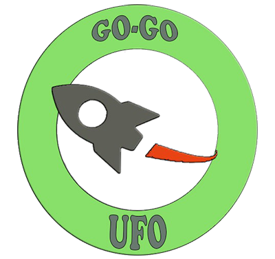

# GO-GO UFO

### Definición general proyecto

Los retos principales de este proyecto consiste en crear una sitio web funcional, diseñar un programa de _Web Scrapping_ que pueda almacenar la información de los productos que se encuentren en el sitio web en una base de datos.

### Requisitos del proyecto

Los requisitos del proyecto se encuentran divididos por módulos:

#### Lenguaje de Marcas

- Crear el sitio web corporativo de la organización. Inventar los productos y servicios hasta conseguir un
